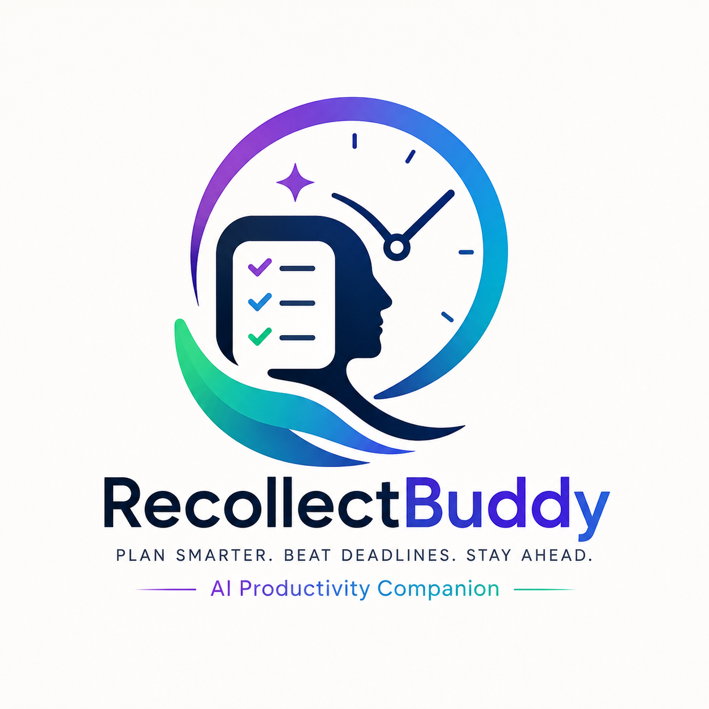

<div align="center">



# 🚀 RecollectBuddy

### AI Executive Assistant for Smarter Productivity

**Plan Smarter • Beat Deadlines • Stay Ahead**

🌐 **Live Demo:** https://recollectbuddy.vercel.app/

📂 **GitHub Repository:** https://github.com/Danieljenu/recollectbuddy

</div>

---

## 🧠 Overview

RecollectBuddy is an AI-powered productivity platform that goes beyond traditional reminder applications.

Instead of simply notifying users about upcoming deadlines, RecollectBuddy intelligently analyzes tasks, schedules, priorities, and user behavior to proactively recommend the best course of action.

Think of it as your personal **AI Executive Assistant** that helps you stay organized, reduce stress, and finish work before deadlines.

---

## ✨ Key Features

- 🤖 AI Executive Assistant
- 📅 Smart Schedule Optimization
- 💬 AI Productivity Chat
- ✅ Task Management
- 📆 Calendar Integration
- 📊 Productivity Analytics
- 🎯 Habit Tracker
- 🌙 Modern Dark UI
- 📱 Responsive Design

---

## 🖼 Screenshots

### Dashboard

> *(Add dashboard screenshot here)*

### AI Assistant

> *(Add AI Assistant screenshot here)*

### Planner

> *(Add Planner screenshot here)*

---

## 🛠 Tech Stack

| Technology | Purpose |
|------------|---------|
| Next.js | Frontend Framework |
| React | UI |
| TypeScript | Language |
| Tailwind CSS | Styling |
| Gemini AI | AI Assistant |
| Vercel | Deployment |
| GitHub | Version Control |

---

## 📂 Project Structure

```text
src/
├── app/
├── components/
├── hooks/
├── lib/
├── public/
└── styles/
```

---

## 🚀 Installation

Clone the repository

```bash
git clone https://github.com/Danieljenu/recollectbuddy.git
```

Install dependencies

```bash
npm install
```

Run the development server

```bash
npm run dev
```

Open

```
http://localhost:3000
```

---

## 🌍 Live Demo

https://recollectbuddy.vercel.app/

---

## 📌 Roadmap

- Google Calendar Sync
- Voice Assistant
- Mobile App
- WhatsApp Integration
- AI Weekly Reports
- Team Collaboration

---

## 👨‍💻 Developer

**Daniel Jenu**

GitHub: https://github.com/Danieljenu

---

## ⭐ Support

If you like this project, consider giving it a ⭐ on GitHub.

Made with ❤️ using Next.js + TypeScript + AI.
